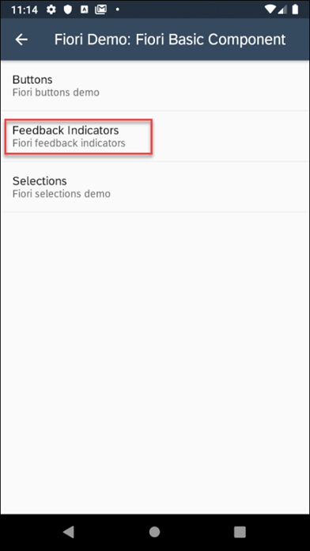
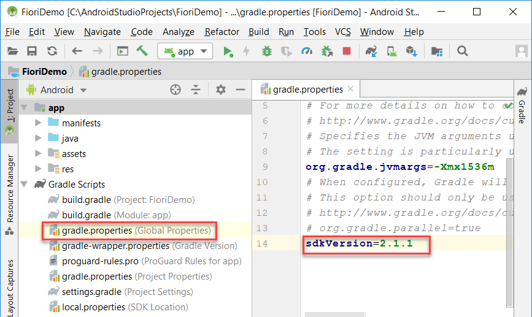

# FioriUI Demo Application

## Description

This application demonstrates the available components in the Fiori UI library.  The app is intended to provide an example implementation of each control, so that users can take the samples and expand their own applications to use the Fiori library.

If you are new to the SAP Cloud Platform SDK for Android, [Get Started with SAP Cloud Platform SDK for Android](https://developers.sap.com/mission.sdk-android-get-started.html), [Step by Step with the SAP Cloud Platform SDK for Android](https://blogs.sap.com/2018/10/15/step-by-step-with-the-sap-cloud-platform-sdk-for-android-part-1/) series, and the [SAP Cloud Platform SDK for Android Learning Journey](https://help.sap.com/doc/221f8f84afef43d29ad37ef2af0c4adf/HP_2.0/en-US/747d6d2ea0534ba99612920c7402631a.html) are great places to start.

## The Finished Product

The app lists the available Fiori components.

Tapping a component type brings the user to more options related to that specific control.

## Requirements

* [Android Studio](https://developer.android.com/studio/index.html) version 3.4
* [SAP Cloud Platform SDK for Android from Trial Downloads](https://www.sap.com/developer/trials-downloads/additional-downloads/sap-cloud-platform-sdk-for-android-15508.html) or [SAP Cloud Platform SDK for Android from Software Downloads](https://launchpad.support.sap.com/#/softwarecenter/template/products/_APP=00200682500000001943&_EVENT=NEXT&HEADER=Y&FUNCTIONBAR=Y&EVENT=TREE&NE=NAVIGATE&ENR=73555000100800001281&V=MAINT&TA=ACTUAL/SAP%20CP%20SDK%20FOR%20AND) version 2.1.1

The blog [Step by Step with the SAP Cloud Platform SDK for Android](https://blogs.sap.com/2018/10/15/step-by-step-with-the-sap-cloud-platform-sdk-for-android-part-1/) contains additional details on how to setup and install the SDK.

There is extensive documentation at [Fiori for Android Design Guidelines](https://experience.sap.com/fiori-design-android/explore/) and [Fiori Development](https://help.sap.com/doc/c2d571df73104f72b9f1b73e06c5609a/Latest/en-US/docs/fioriui/fiori_ui_overview.html).

## Configuration

Open the project in Android Studio.

To successfully run the application, the `sdkVersion` variable in the `gradle.properties` file needs to be set correctly. Depending on which version of the SDK you have installed (ex. `2.1.1`), change the variable as shown in the screenshot below.

Run the project to deploy it onto an emulator or device.

## Known Issues

There are no known issues at this time.

## How to obtain support

If you have questions/comments/suggestions regarding this app please
post them using the tag [SAP Cloud Platform SDK for Android](https://answers.sap.com/tags/73555000100800001281) or if you encounter an issue, you can [create a ticket](https://github.com/SAP/cloud-sdk-android-fiori-ui-components/issues/new).

## License

Copyright (c) 2019 SAP SE or an SAP affiliate company. All rights reserved.
This file is licensed under the SAP Sample Code License except as noted otherwise in the [LICENSE file](LICENSE).
